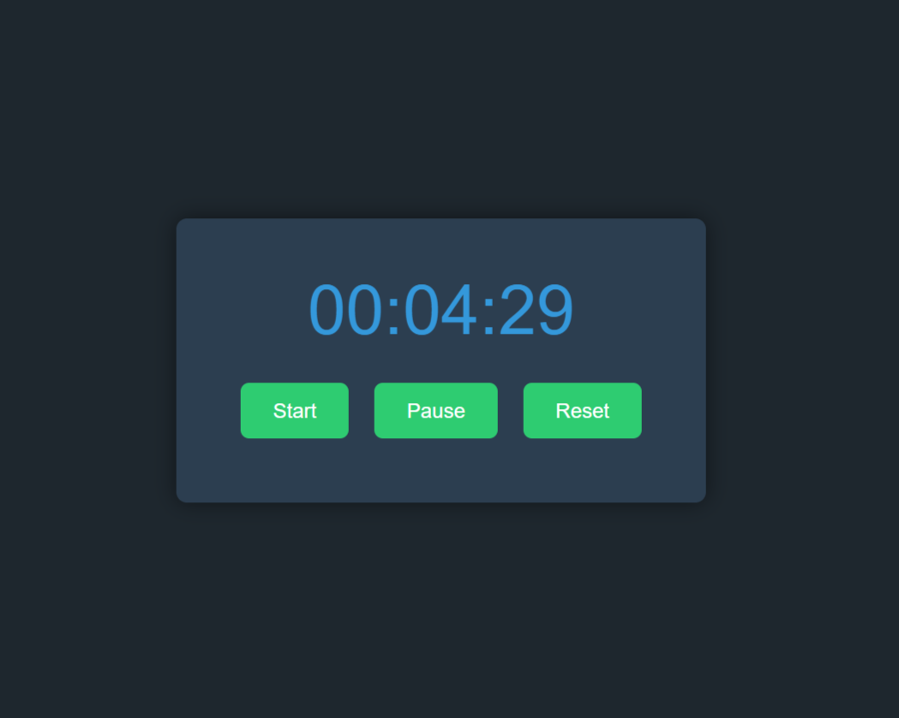

# Stopwatch

A simple stopwatch implemented using HTML, CSS, and JavaScript with start, pause, and reset functionality.

## Preview



## Table of Contents

- [Features](#features)
- [Usage](#usage)
- [How It Works](#how-it-works)
- [Contributing](#contributing)
- [License](#license)

## Features

- **Start**: Begin the stopwatch to measure elapsed time.
- **Pause**: Pause the stopwatch to temporarily halt time measurement.
- **Reset**: Reset the stopwatch to zero.

## Usage

1. Clone the repository:

    ```bash
    git clone https://github.com/shihabcodes/stopwatch.git
    ```

2. Open `index.html` in a web browser to use the stopwatch.

3. Click the "Start" button to begin the timer, "Pause" to temporarily stop it, and "Reset" to set the timer back to zero.

## How It Works

The stopwatch keeps track of hours, minutes, and seconds. The timer starts when you click the "Start" button, pauses with the "Pause" button, and resets to zero with the "Reset" button.

## Contributing

Contributions are welcome! If you have suggestions or improvements, feel free to open an issue or create a pull request.

1. Fork the project.
2. Create a new branch (`git checkout -b feature/awesome-feature`).
3. Commit your changes (`git commit -m 'Add awesome feature'`).
4. Push to the branch (`git push origin feature/awesome-feature`).
5. Open a pull request.

## License

This project is licensed under the MIT License - see the [LICENSE](LICENSE) file for details.
